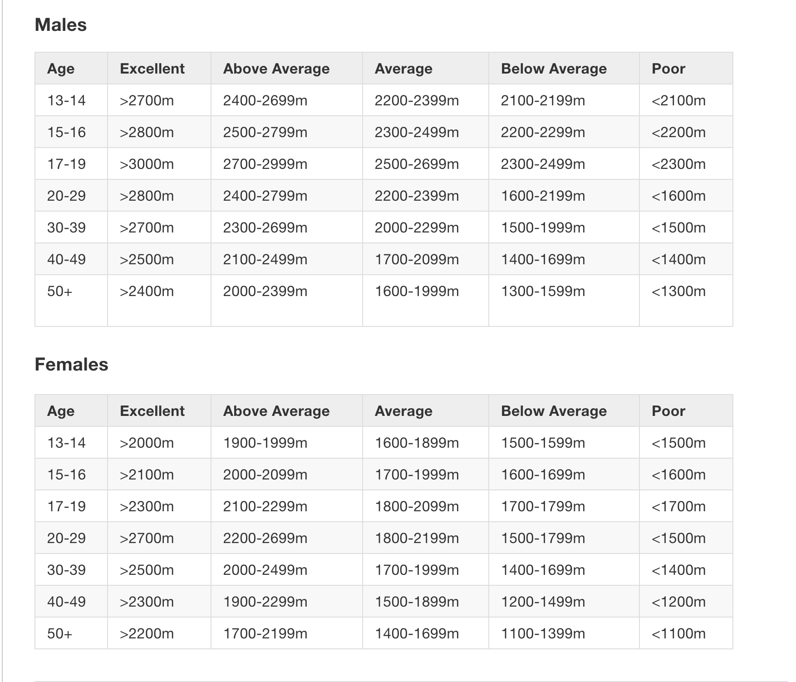

# Cooper Test Template

The challenge this weekend was to convert a cooper test template into JavaScript.

To use the program you need to:

Create a person.
Person takes arguments gender, distance, age as an object.

Call result_cooper function and get your result.

```
var person = new Person({gender: 'female', distance: 2200, age: 21});
person.result_cooper();

=> 'Above Average'
```
That was easy!

Nah if you wanna try it for real this is how you do it.

## To undertake this test you will require:

* 400 meter track
* Stopwatch
* Whistle
* Assistant
How to conduct the test
This test requires the athlete to run as far as possible in 12 minutes.

The athlete warms up for 10 minutes
The assistant gives the command “GO”, starts the stopwatch and the athlete commences the test
The assistant keeps the athlete informed of the remaining time at the end of each lap (400m)
The assistant blows the whistle when the 12 minutes has elapsed and records the distance the athlete covered to the nearest 10 meters


